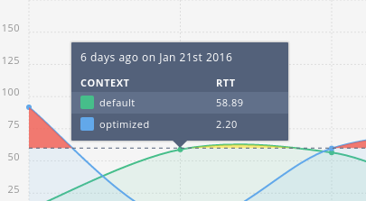

# chartist-plugin-tip
More detailed and better to access tooltips for chartist.



## Usage
```javascript
var chartData = [];

// seconds is the value on the timeline
chartData[seconds].push({
    id     : window.guid(),
    name   : 'Your unique name',
    series : 'Series Name',
    // see plugin options columns
    value  : Y_VALUE,
    time   : TIME_IN_SEC,
    // see plugin options title (:ago)
    ago    : typeof moment === 'function' ? moment( seconds * 1000 ).fromNow() : null,
    // see plugin options title (:date)
    date   : typeof moment === 'function' ? moment( seconds * 1000 ).format('MMM Do YYYY') : null,
});

var options = {
    ctTipData: chartData, // add tooltip data to the Chartist options to prevent problems when updating the chart at runtime
    plugins: [
        Chartist.plugins.ctTip(
        {
            title: ':ago on :date',
            columns: [{
                title: 'Context',
                value: 'series',
                size: 66
            }, {
                title: 'GB',
                value: 'value',
                size: 33
            }]
        })
    ],
};
```